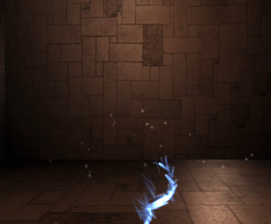
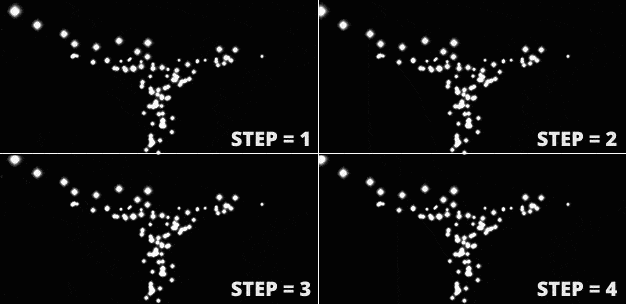

## aframe-particleplayer-component

[](https://npmjs.org/package/aframe-particleplayer-component)
[](https://npmjs.org/package/aframe-particleplayer-component)

This component allows replaying particle systems with baked behaviour. This is,
instead of calculating the position of all particles on each frame using maths,
that value is taken from a cache file (JSON format) with the movement of all
the particles already calculated.



**In short:**

1. Install [the particleplayer Blender add-on](https://github.com/supermedium/aframe-particleplayer-component/tree/master/exporters/blender#blender-exporter-add-on).
2. Design your particle system in Blender, and export a JSON.
3. Use this component to load the JSON and reproduce same particle system.


Features:

* Baked particle system loading
* Animation speed / duration
* Frame interpolation (no frame jumps when replaying at slow speeds)
* Replay only a percentage of particles (randomly picking on each loop)
* Delay and loop
* Overall simulation and particle scaling
* Particles texture, color, shader and blending

Real-time particle systems behaviour (using already made solutions or your own)
is often good enough but sometimes specific 3D packages (Blender, Maya,
Houdini, Cinema4D or many others, for example) can give you much more control
and direction, with lots of parameters, forces and influencers. This is what is
this component for, and has some pros and cons that you should be aware of:

#### Pros:

* **Easier, more complex and richer particle system behaviours**. Use all the
features and power of your 3d package. You can do whatever you want: add
multiple sources with arbitrary shapes, use fluid solvers, add multiple
forces, influencers and collisions... On the cache file only the final
position (and rotation) of the particles is exported, so it does not matter
how you design them.

* **More performant for complex simulations** Since all the hard work has
already been done by the 3D package, when in real-time the component just has
to replay the animation, not calculate anything. Each particle system takes one
draw call (one merged buffer geometry).

#### Cons:

* **Static behaviour**. Since behaviour is already baked in the cache file,
particles move always the same. This can be overcome using `count` parameter
so only a random percentage of the particles are used on each replaying,
adding a lot of variation effectively.

* **Big cache JSON files**. If you don't take care, cache files can be quite
big for big simulations (both in number of particles and duration),
increasing downloading times. Here is a table with some example numbers:

|                | 10 frames   | 100 frames  | 500 frames  |
|----------------|-------------|-------------|-------------|
| 10 particles   | 1.7K / 2.3K | 19K/ 25K    |  100K/ 130K |
| 100 particles  | 17K / 22K   | 177K / 236K | 0.9M / 1.3M |
| 1000 particles | 160K / 222K | 1.8M / 2.3M | 9.5M / 13M  |
| 10000 particles| 1.6M / 2.2M | 18M / 23M   | 95M / 121M  |

\* Values using default `precision` = 1000, without / with rotation exported

\** These are raw sizes, without server compression, which in the case of JSON
is very significant.

File size can be drastically reduced by:

+ Exporting less particles and shorter animation :D
+ Only exporting position, not rotation of particles
+ Use `step` parameter to export every x frames instead of all frames. Using
the `interpolation` parameter of the component can do marvels here, and the
difference can be unnoticeable:



So, as a general rule, you should **use this component for small and short
simulations**. Ideal for visual effects like sparks, magic spells, small
trails, visual accents, and such.

For [A-Frame](https://aframe.io).

### API

| Property    | Description                                                                                                                                             | Default Value         |
| --------    | -----------                                                                                                                                             | -------------         |
| blending    | Particle's material blending mode. Possible values: 'normal', 'additive', 'multiply' or 'substractive'                                                  | 'additive'            |
| color       | Particle's material color                                                                                                                               | '#fff'                |
| count       | Number of particles to draw. If less than total available, they are picked randomly. You can set a specific number or a percentage (using % symbol)     | '100%'                |
| delay       | Milliseconds of wait until replaying the animation                                                                                                      | 0                     |
| dur         | Duration (in ms) of the animation                                                                                                                       | 1000                  |
| img         | Texture to use in particles. None by default (flat plane)                                                                                               |                       |
| interpolate | Interpolate particle positions among frames on slow replayings (big enough `dur` parameter)                                                             | false                 |
| loop        | Whether loop the animation (true) or not (false). Alternatively, you can use a number here for a specific number of loops                               | 'false'               |
| on          | Event that starts the animation                                                                                                                         | 'init' (on app start) |
| poolSize    | Number of possible simultaneous systems to play at once                                                                                                 | 5                     |
| protation   | Particle rotation offset. To fine tune their initial rotation                                                                                           | 0 0 0                 |
| pscale      | Particles scale. By default particles are about 0.1 width (final size depends on texture ratio). You can increase their size changing this scale factor | 1.0                   |
| scale       | Scale of the overall system. Each particle position is multiplied by this factor                                                                        | 1.0                   |
| shader      | Particle's material shader. Can be 'flat', 'lambert', 'phong' or 'standard'                                                                             | 'flat'                |
| src         | File cache JSON resource                                                                                                                                |                       |

Events emitted:

| event    | Description                                   |
| -------- | -----------                                   |
| loop     | last frame reached, will start another loop   |
| finished | all loops and frames finished, animation ends |


### Cache file format

You can generate a cache file using the [available
exporters](https://github.com/feiss/aframe-particleplayer-component/tree/master/exporters)
(only Blender for the moment, you are welcome to add support to other 3D
Packages).

You shouldn't care about this section unless you want to implement a new
exporter. Cache file format is a plain JSON file with these main fields:

**V.1.0**

```
{
	version: '1.0',
	precision: 1000,
	rotation: true,
	sprite_rotation: [0, 0, 0],
	frames: [<frames>]
}
```

where &lt;frames&gt; is the array of frames of the animation, and each one is
another array with the position (and optionally rotation) of all particles, in
array format:

```
	frames: [
		[particle1_data, particle2_data, ... particleN_data], // frame 0
		[particle1_data, particle2_data, ... particleN_data], // frame 1
		...
		[particle1_data, particle2_data, ... particleN_data] // last frame
	]

	// and each particleX_data has the format:

	[pos.x, pos.y, pos.z, rot.x, rot.y, rot.z]
```

To optimize the final file size, all position and rotation values are
multiplied by `precision` value and then trunc() when exported (eg.
'0.233523523'.length > '233'.length).

### Installation

#### Browser

Install and use by directly including the [browser files](dist):

```html
<head>
  <script src="https://aframe.io/releases/0.8.2/aframe.min.js"></script>
  <script src="https://unpkg.com/aframe-particleplayer-component/dist/aframe-particleplayer-component.min.js"></script>
</head>

<body>
  <a-scene>
  	<a-assets>
  		<a-asset-item src="particles.json" id="particlesJSON"></a-asset-item>
  	</a-assets>
    <a-entity particleplayer="src: #particlesJSON"></a-entity>
  </a-scene>
</body>
```

#### npm

Install via npm:

```bash
npm install aframe-particleplayer-component
```

Then require and use.

```js
require('aframe');
require('aframe-particleplayer-component');
```
