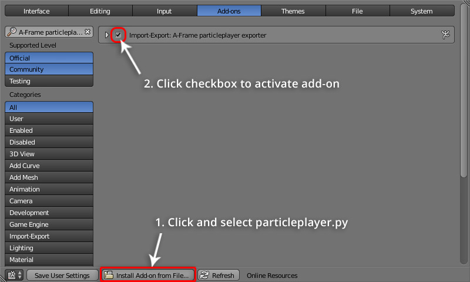
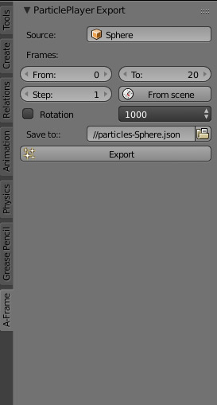

# Blender exporter add-on

## Installation

1. Clone the repo or just download [particleplayer.py](https://raw.githubusercontent.com/feiss/aframe-particleplayer-component/master/exporters/blender/particleplayer.py).
2. Open Blender and open preferences window `File > User Preferences...`
3. Click on the button `Install Add-on from File...` (on the bottom of the window) and find `particleplayer.py` on your disk.
4. Click on the checkbox to activate the add-on.
5. Click on "Save User Settings" if you want to keep the add-on installed permanently (if not, you'll have to repeat previous steps each time you start Blender).

## Usage

