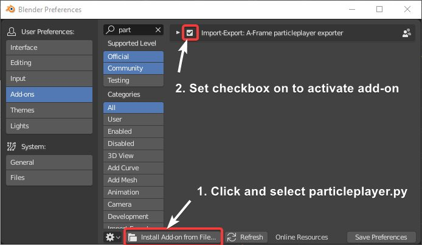
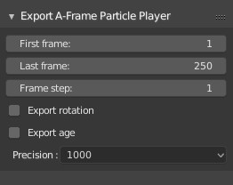
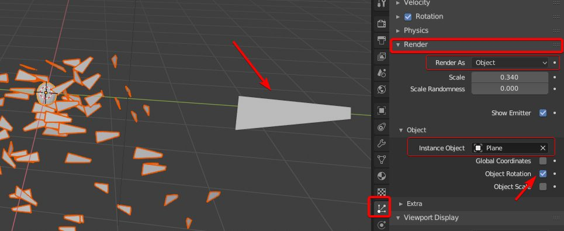

# Blender Exporter Add-On

Add-on to export Blender particle systems.

## Installation

1. Clone the repo or just download [particleplayer.py](https://raw.githubusercontent.com/feiss/aframe-particleplayer-component/master/exporters/blender2.8/particleplayer.py).
2. Open Blender and open preferences window `Edit > Preferences...`
3. Click on the button `Install Add-on from File...` (on the bottom of the window) and find `particleplayer.py` on your disk.
4. Click on the checkbox to activate the add-on.
5. Click on "Save User Settings" if you want to keep the add-on installed permanently (if not, you'll have to repeat previous steps each time you start Blender).

## Usage

Select object with a particle system attached and go to `File > Export > A-Frame Particle Player`

  + **First/Last frame**: First and last frames to export. They are automatically initialized from the current animation range.
  + **Frame step**: If you want to export one each X frames. Use `1` for exporting all frames, `2` for exporting one each two frames, etc.
+ **Rotation**: Set on if you want to export the rotation of the particles too (not only the position).
+ **Precision / 1000**: Precision of the values to export. More zeroes, more precision.

All parameters determine final file size. If you want a smaller file, try
reducing `precision`, increasing `step`, or not exporting the `rotation` if is
not necessary.

To preview particles in blender and finetune initial rotation, use a textured
plane object in **render / instance object** with `Object rotation` option on:

